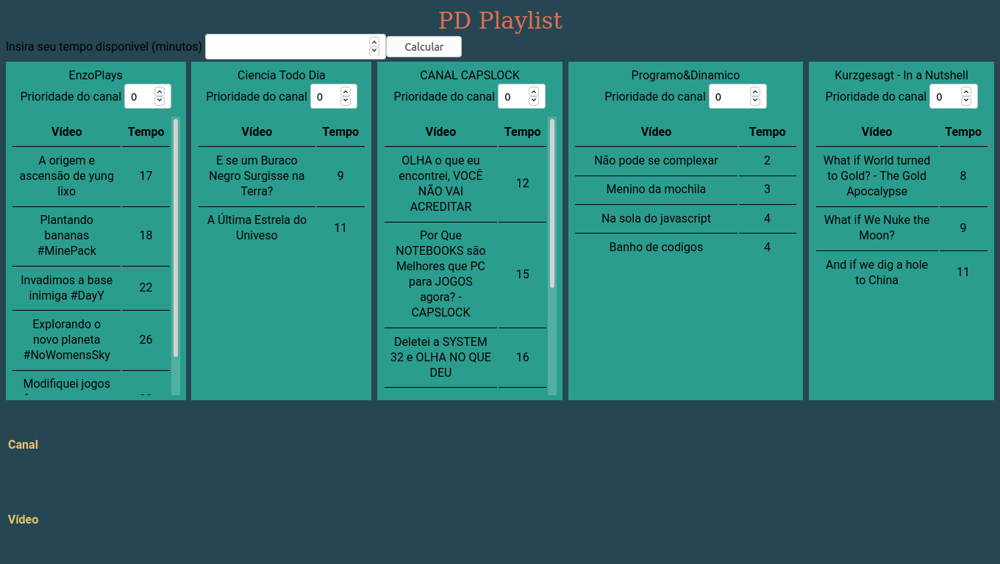
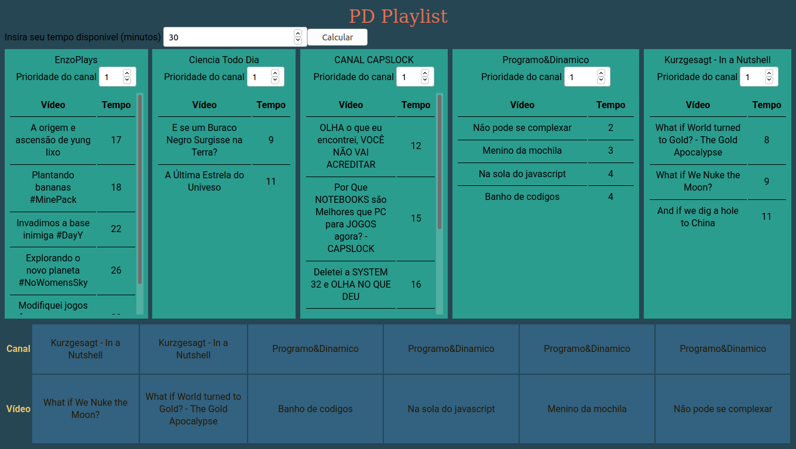
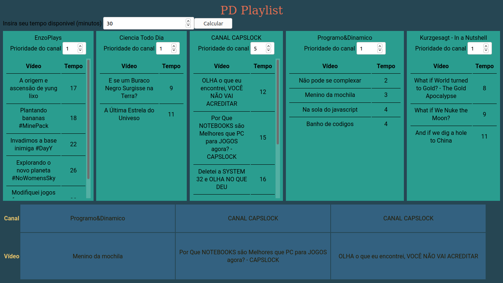

# PD_Playlist

**Número da Lista**: 07<br>
**Conteúdo da Disciplina**: Programação Dinâmica<br>

## Alunos
|Matrícula | Aluno |
| -- | -- |
| 18/0030272 | Antonio Ruan Moura Barreto |
| 18/0029177 | Wagner Martins da Cunha |

## Sobre 
O PD Playlist é uma aplicação que cria playlists de reprodução de vídeos de um conjunto de canais conforme as preferências do usuário. As playlists atendem a um limite de tempo que o usuário define como disponível para assistir esses vídeos. O projeto utiliza o algoritmo do Knapsack PD para montar as playlists.

## Screenshots







## Instalação 
**Linguagem**: Javascript<br>
**Framework**: ReactJs<br>

Requisitos: NodeJs e npm

Primeiro, faça o download dos arquivos na sua máquina com:

```
$ git clone https://github.com/projeto-de-algoritmos/PD_Playlist.git
```

Após isso vá para a pasta app, onde se encontram os arquivos para execução do projeto com:

```
$ cd PD_Playlist/app
```

Agora é só instalar as dependências com o seguinte comando:

```
$ npm install
```

## Uso 

Para rodar o projeto, após sua instalação, basta realizar este comando:

```
$ npm start
```

<!-- ## Outros 
Quaisquer outras informações sobre seu projeto podem ser descritas abaixo. -->
